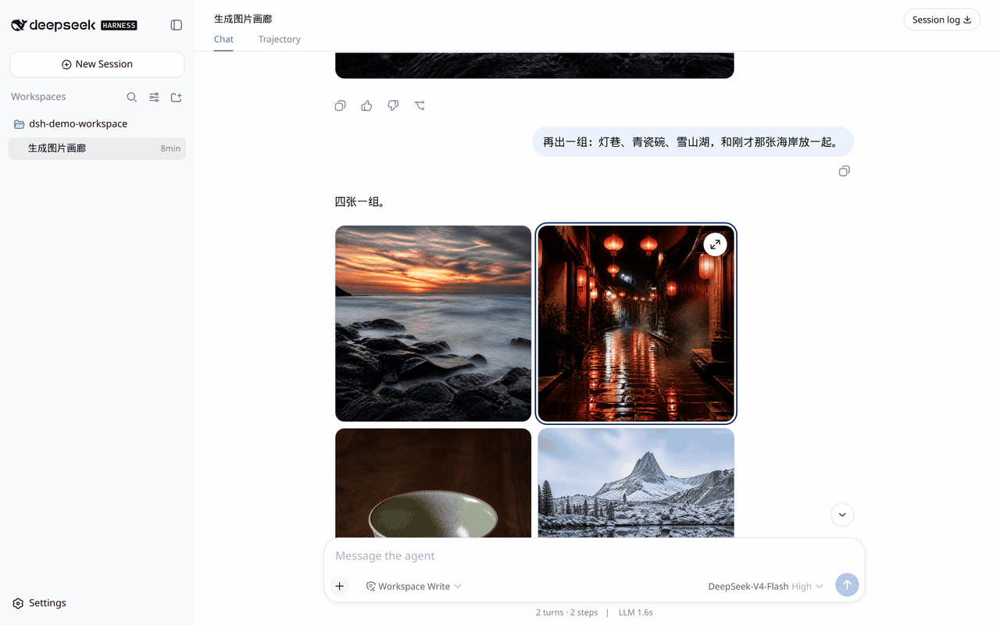
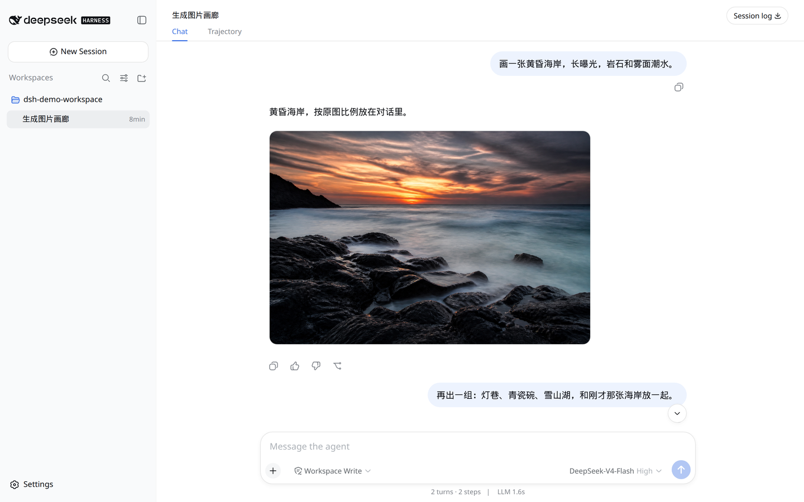
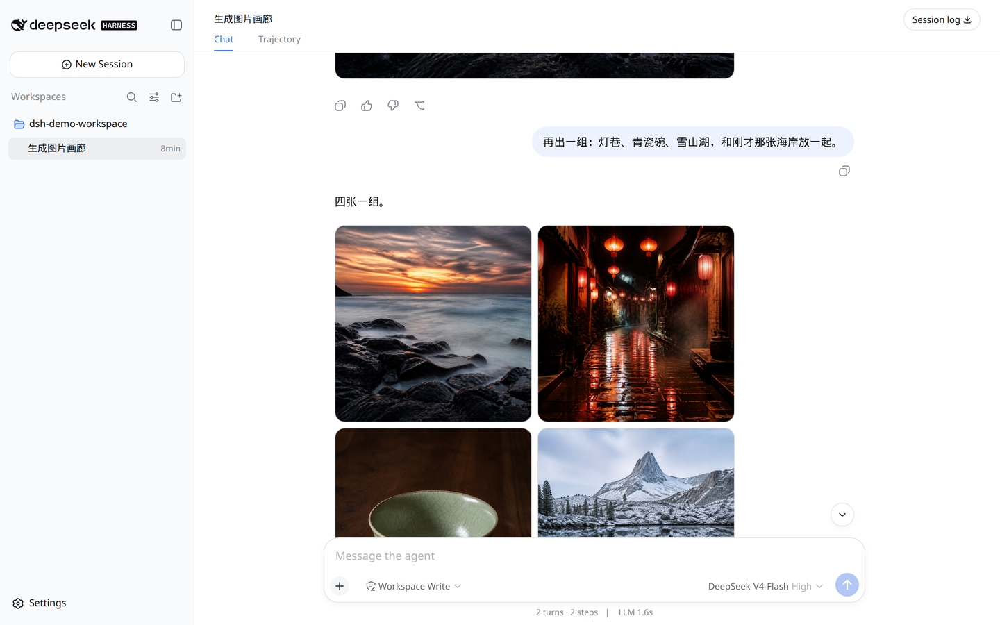
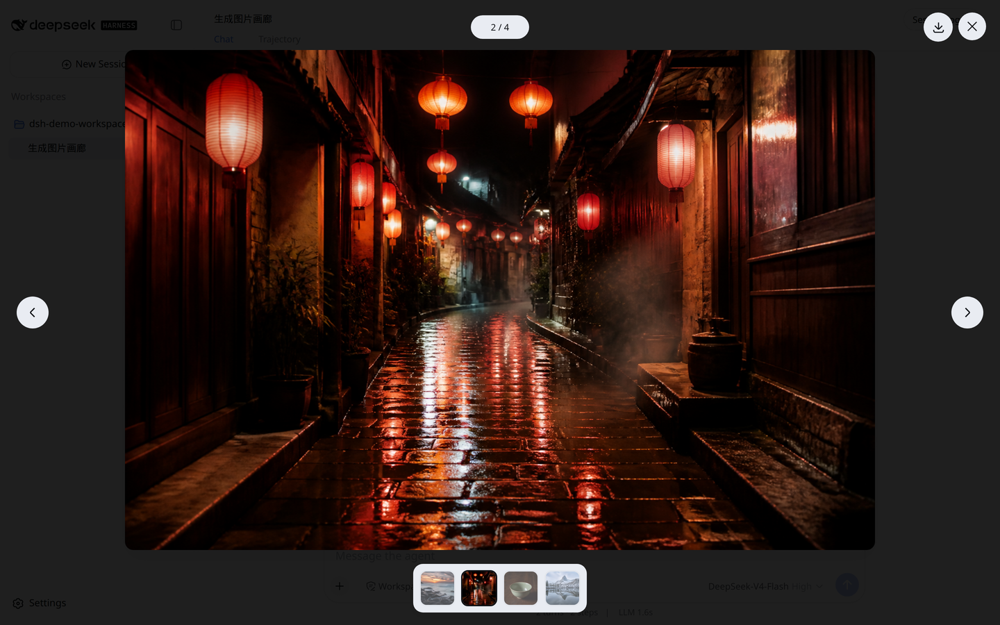
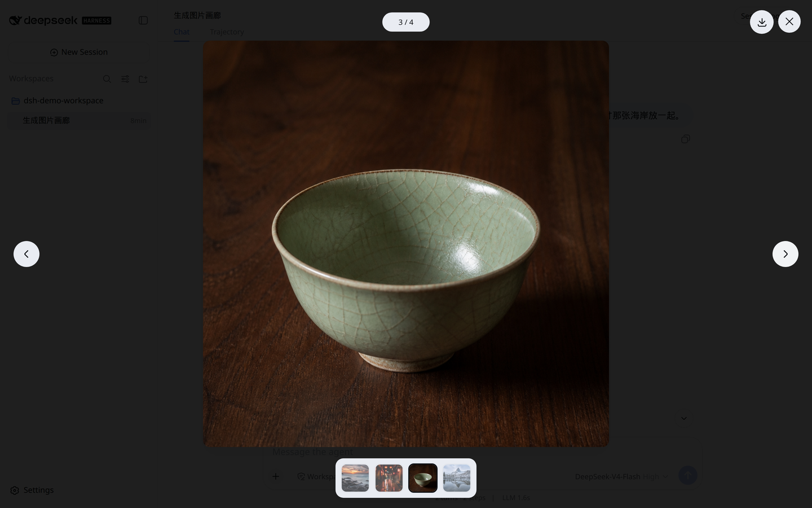

[English](README.en.md)

# dsh-image-conatiner

```sh
dsh plugin --profile web add github:aa2246740/dsh-image-conatiner
```

PATH 上需要官方 `dsh`（没有的话用 `npx @deepseek-ai/dsh`）和 **pnpm**。装完重启这个 Host，刷新页面。`dsh plugin add` 只写 profile，不会热挂正在跑的 Host。

助手刚画出来的图按比例铺开，两三张并排，点开全屏翻。包名里的 `conatiner` 是故意留的。











## 安装

这条 `github:` 命令能装上，是因为包装了 `dsh.bundle.patch`，并且仓库提交了编好的 `lib/`。官方 `dsh plugin add` 在 `$DSH_HOME/profiles/web` 里跑 pnpm，再把这个包装进 `dsh.profile.bundles`。不需要 Creator Mode，也不需要另装一套工具。

没有 `dsh` 时：

```sh
npx @deepseek-ai/dsh plugin --profile web add github:aa2246740/dsh-image-conatiner
```

或本地 clone：

```sh
git clone https://github.com/aa2246740/dsh-image-conatiner.git
dsh plugin --profile web add ./dsh-image-conatiner
```

```sh
dsh plugin --profile web remove dsh-image-conatiner
```

面向官方 DeepSeek Harness **0.1.5-rc.2**。它占用公开的 `conversation.message.images` 槽，优先级 `-10`，盖住内置画廊。`v0.2.0` 仍是面向 `v0.1.0-rc.8` 的已发布版本。

还在 rc.7 上的话，先 checkout 标签 `v0.1.0`。0.1.0 占的是补丁加上的 `conversation.chat.assistant.images`：

```text
patches/deepseek-harness-v0.1.0-rc.7-assistant-images.patch
```

没装上的时候，对话还是走自带的画廊。如果旧安装是通过 `file:` 写进 profile 的，改成指向本目录的 `link:` 并重启 Web 宿主。

## 开发

```bash
pnpm install --frozen-lockfile
pnpm test
pnpm typecheck
```

仓库里的 `lib/` 就是官方 `github:` 安装用的产物。重新编译 client 见 [CONTRIBUTING.md](CONTRIBUTING.md)。安全问题按 [SECURITY.md](SECURITY.md) 私下说。

## 许可

MIT。可选的 Harness 补丁仅用于 rc.7，改的是 MIT 许可的上游源码。
